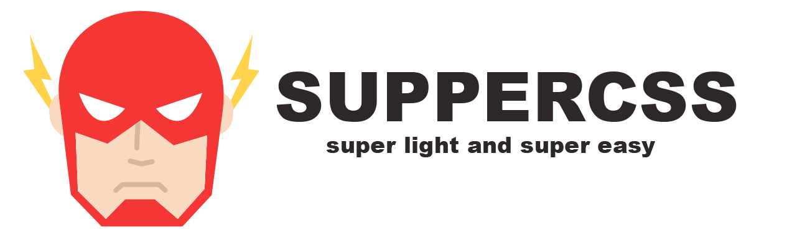

## SuperCSS

Just a mini library CSS to help people create Front-end base on Google AMP rule
* Webpack
* Minify
* Mixins Media Query
* Brotli Compression Algorithm

### GUIDANCE
1. First git clone the project to your local
2. Run command "npm run build" to get app.min.css inside release folder

### NEW UPDATE
Brotli Compression Algorithm